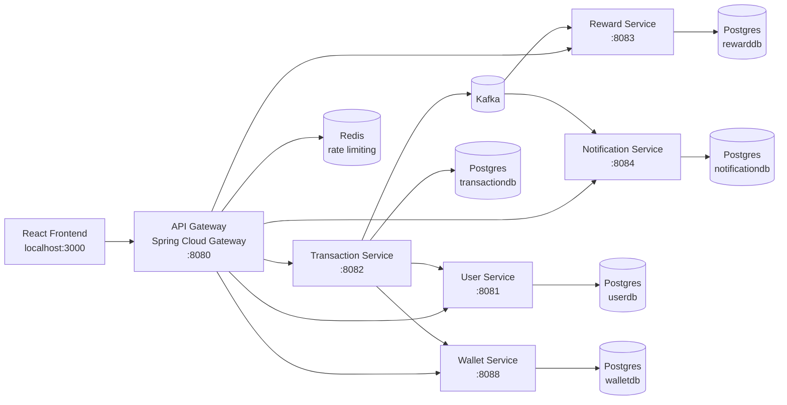
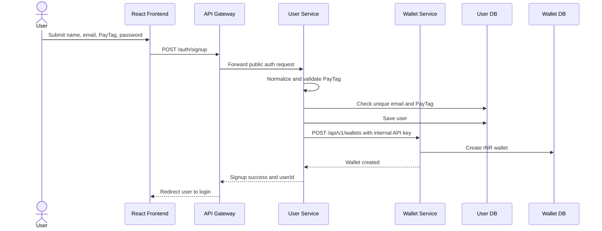
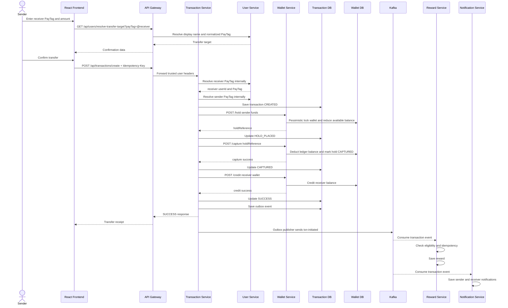
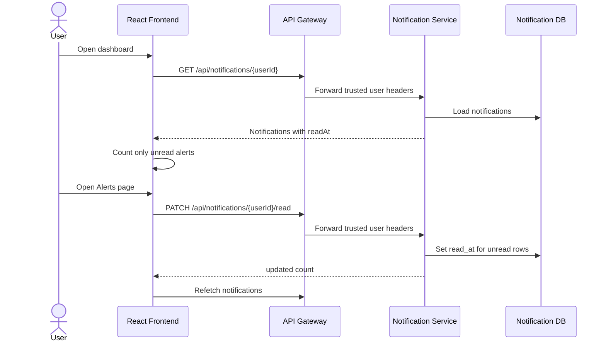

# PayFlow

PayFlow is a full-stack wallet-to-wallet payments platform built as a Spring Boot microservice system with a React fintech dashboard. It models a production-style payment flow: authenticated users create wallets, top up balances, send money by PayTag, review transactions, receive rewards, and manage notifications.

The project is intentionally structured around production practices rather than a single monolith:

- API Gateway as the only public backend entry point.
- Separate service-owned PostgreSQL databases.
- JWT authentication at the edge plus service-boundary checks.
- Internal API keys and gateway request headers for trusted service calls.
- BigDecimal/decimal.js money handling instead of floating point.
- Wallet holds and capture flow to avoid direct unsafe balance mutation.
- Durable transaction outbox for Kafka event publication.
- Kafka consumers for rewards and notifications.
- Flyway migrations and Hibernate `ddl-auto=validate`.
- Actuator health/readiness and Prometheus metrics.
- Unit, integration, and global flow tests.

## Contents

- [System Overview](#system-overview)
- [Architecture](#architecture)
- [Core User Flows](#core-user-flows)
- [Services](#services)
- [Data Ownership](#data-ownership)
- [Security Model](#security-model)
- [Reliability Model](#reliability-model)
- [Frontend](#frontend)
- [Local Development](#local-development)
- [Verification](#verification)
- [API Surface](#api-surface)
- [Operations](#operations)
- [Documentation Map](#documentation-map)

## System Overview

PayFlow supports these primary capabilities:

- Account creation with unique PayTags such as `@alice`.
- Login with JWT-backed session handling.
- Wallet creation during signup.
- Wallet top-up by the wallet owner.
- Wallet-to-wallet transfer by PayTag.
- Sender-side failed transaction history without polluting receiver history.
- Incoming transaction history that shows the sender PayTag.
- Reward generation after successful eligible transfers.
- User notifications with read/unread state.
- Admin-only user, reward, notification, and reconciliation views.

The browser only talks to the gateway. Internal services are not exposed as public app APIs.

## Architecture



### Request Path

1. The frontend sends requests to `/auth/**` and `/api/**`.
2. The API Gateway validates JWTs except for public auth routes.
3. The gateway strips untrusted identity/internal headers from the client request.
4. The gateway forwards trusted headers such as `X-User-Id`, `X-User-Role`, and `X-Gateway-Request-Key`.
5. Downstream services enforce ownership/admin/internal boundaries.
6. Financial side effects happen through wallet and transaction services, not directly from UI screens.

## Core User Flows

### Signup



Design choice: signup does not auto-login. The backend creates the user and wallet, then the frontend sends the user to login to receive a JWT.

### Wallet-to-Wallet Transfer



Important product behavior:

- The receiver is addressed by PayTag, not raw user ID.
- The sender sees failed outgoing attempts.
- The receiver only sees successful incoming transfers.
- Incoming history displays `From @sender`, not a generic user label.

### Notification Read State



## Services

| Service | Port | Responsibility | Database |
| --- | ---: | --- | --- |
| `frontend` | `3000` | React dashboard served by Nginx in Docker | none |
| `api-gateway` | `8080` | Routing, JWT validation, CORS, Redis rate limiting | none |
| `user-service` | `8081` | Auth, users, PayTags, wallet creation on signup | `userdb` |
| `wallet-service` | `8088` | Wallet balances, top-ups, holds, captures, credits, releases | `walletdb` |
| `transaction-service` | `8082` | Transfer saga orchestration, transaction state, outbox, reconciliation | `transactiondb` |
| `reward-service` | `8083` | Reward read API and Kafka reward consumer | `rewarddb` |
| `notification-service` | `8084` | Notification read API, mark-read API, Kafka notification consumer | `notificationdb` |
| `global-flow-tests` | n/a | Cross-module payment contract tests | test doubles |

## Data Ownership

Each service owns its schema and migrations:

- `user-service`: `app_user`, unique email, unique PayTag.
- `wallet-service`: `wallets`, `wallet_holds`, wallet-side transaction records.
- `transaction-service`: payment transaction state and outbox events.
- `reward-service`: rewards, with unique transaction ID for idempotency.
- `notification-service`: notifications, including `read_at`.

Cross-service joins are intentionally avoided. Where a read model needs a public identity, the transaction service stores `senderPayTag` and `receiverPayTag` as denormalized display data.

## Security Model

Security is layered:

- Browser only calls the frontend and API Gateway.
- Gateway validates JWTs and injects trusted identity headers.
- Gateway removes incoming client-supplied `X-User-*`, `X-Internal-Api-Key`, and `X-Gateway-Request-Key` before adding trusted values.
- User-facing services validate owner/admin access from trusted headers.
- Wallet mutation endpoints such as credit, debit, hold, capture, and release require an internal API key.
- Transaction APIs require a gateway request key to prevent direct service-port calls.
- Docker Compose exposes only local infrastructure ports on `127.0.0.1`; app service ports are internal through Docker networking.

This is not a substitute for production mTLS or service mesh identity.

## Reliability Model

The system uses several reliability controls:

- BigDecimal for backend money values.
- `decimal.js` for frontend display/validation decisions.
- Wallet pessimistic locking for balance mutation.
- Hold/capture/credit transfer sequence.
- Idempotency key on transaction creation.
- Unique constraints for user identity, wallet ownership, reward event idempotency, and transaction references.
- Transaction outbox to avoid losing Kafka events after DB success.
- Retry settings for Kafka consumers.
- Reconciliation job for stale or incomplete transaction states.
- Actuator health/readiness and Prometheus metrics.

## Frontend

The frontend is a protected product dashboard, not a marketing page.

Routes:

```text
/auth/login
/auth/signup

/app/dashboard
/app/top-up
/app/send
/app/transactions
/app/rewards
/app/notifications
/app/profile

/admin/users
/admin/rewards
/admin/notifications
```

Important frontend behavior:

- Session token is restored from `sessionStorage` before protected route queries run.
- Token is attached to every protected request.
- Unauthorized responses clear the local session.
- Forms clear stale validation/backend errors on focus or edit.
- Transfer flow verifies PayTag before confirmation.
- Dashboard recent transactions show PayTag counterparties.
- Notification unread count is derived from `readAt`, not total notifications.

## Local Development

### Prerequisites

- Java 21 recommended. Java 17+ should work with the project dependencies.
- Docker and Docker Compose.
- Node.js 22+.
- k6 for load tests if you run `load-tests`.

### Environment

Create `.env` from the example:

```bash
cp .env.example .env
```

The start script supplies local-development defaults if `.env` is missing, but real environments should provide strong secrets explicitly:

```text
POSTGRES_USER
POSTGRES_PASSWORD
JWT_SECRET
INTERNAL_API_KEY
GATEWAY_REQUEST_KEY
PGADMIN_DEFAULT_PASSWORD
GRAFANA_ADMIN_PASSWORD
FRONTEND_ALLOWED_ORIGINS
```

### Start the Whole App

Run everything in Docker:

```bash
./start-payflow.sh --docker-app
```

Or run infrastructure in Docker and app services locally:

```bash
./start-payflow.sh
```

Useful options:

```bash
./start-payflow.sh --with-pgadmin
./start-payflow.sh --with-observability
./start-payflow.sh --skip-frontend
```

Open:

- Frontend: http://localhost:3000
- API Gateway: http://localhost:8080
- Kafka local listener: `localhost:29092`
- Redis: `localhost:6379`
- pgAdmin: http://localhost:5050 when enabled
- Prometheus: http://localhost:9090 when enabled
- Grafana: http://localhost:3001 when enabled

Stop:

```bash
./stop-payflow.sh
```

Health check:

```bash
./check-services.sh
curl http://localhost:8080/actuator/health
curl http://localhost:3000/healthz
```

## Verification

Backend reactor:

```bash
./mvnw test
```

Frontend:

```bash
cd frontend
npm run verify
```

Docker Compose config:

```bash
POSTGRES_PASSWORD=<strong-random-password> \
PGADMIN_DEFAULT_PASSWORD=<strong-random-password> \
JWT_SECRET=<at-least-32-random-characters> \
INTERNAL_API_KEY=<long-random-service-secret> \
GATEWAY_REQUEST_KEY=<long-random-gateway-secret> \
docker compose config
```

Load test smoke:

```bash
k6 run -e BASE_URL=http://localhost:8080 load-tests/k6/payflow-wallet-transfer.js
```

## API Surface

The frontend calls the gateway only.

### Public Auth

```text
POST /auth/signup
POST /auth/login
```

### User and PayTag

```text
GET /api/users/{id}
GET /api/users/all                         ROLE_ADMIN
GET /api/users/resolve-transfer-target?payTag=@receiver
```

### Wallet

```text
GET  /api/v1/wallets/{userId}              owner or admin/internal
POST /api/v1/wallets/{userId}/top-ups      owner only
```

Internal/service-only wallet mutations:

```text
POST /api/v1/wallets
POST /api/v1/wallets/credit
POST /api/v1/wallets/debit
POST /api/v1/wallets/hold
POST /api/v1/wallets/capture
POST /api/v1/wallets/release/{holdReference}
```

### Transactions

```text
POST /api/transactions/create
GET  /api/transactions/user/{userId}
GET  /api/transactions/{id}
GET  /api/transactions/reconciliation       ROLE_ADMIN
POST /api/transactions/reconciliation/{id}  ROLE_ADMIN
POST /api/transactions/reconciliation/stale ROLE_ADMIN
```

### Rewards

```text
GET /api/rewards/user/{userId}
GET /api/rewards                            ROLE_ADMIN
GET /api/rewards/transaction/{transactionId}
```

### Notifications

```text
GET   /api/notifications/{userId}
PATCH /api/notifications/{userId}/read
POST  /api/notifications                    ROLE_ADMIN
```

## Operations

Logs:

```text
.payflow/logs
docker compose logs -f <service>
```

Migrations:

- Flyway migrations live in each service under `src/main/resources/db/migration`.
- Runtime Hibernate DDL is `validate`.
- Schema changes should be backward-compatible for rolling deploys.

Metrics:

- Services expose Actuator health and Prometheus endpoints.
- Optional Prometheus/Grafana stack is defined in `docker-compose.observability.yml`.

CI:

- GitHub Actions runs backend Maven tests and frontend verification.
- Deployment scaffolding lives under `deployment`.

## Documentation Map

- [Design Document](docs/DESIGN.md)
- [Frontend README](frontend/README.md)
- [API Gateway README](api-gateway/README.md)
- [User Service README](user-service/README.md)
- [Wallet Service README](wallet-service/README.md)
- [Transaction Service README](transaction-service/README.md)
- [Reward Service README](reward-service/README.md)
- [Notification Service README](notification-service/README.md)
- [Global Flow Tests README](global-flow-tests/README.md)
- [Observability README](observability/README.md)
- [Deployment README](deployment/README.md)
- [Load Tests README](load-tests/README.md)
