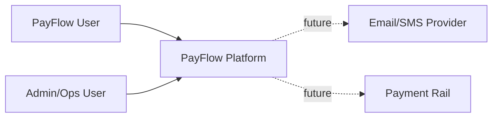
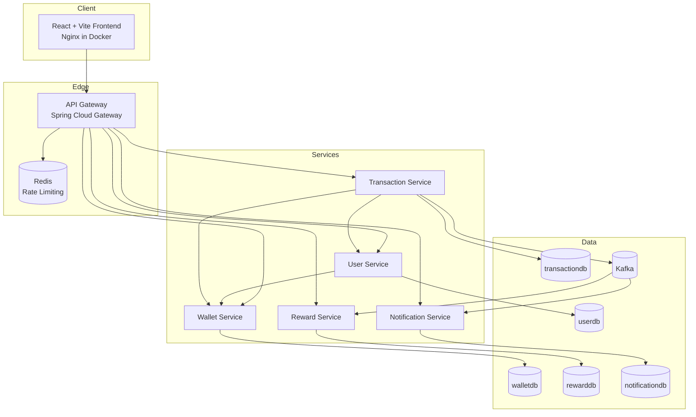
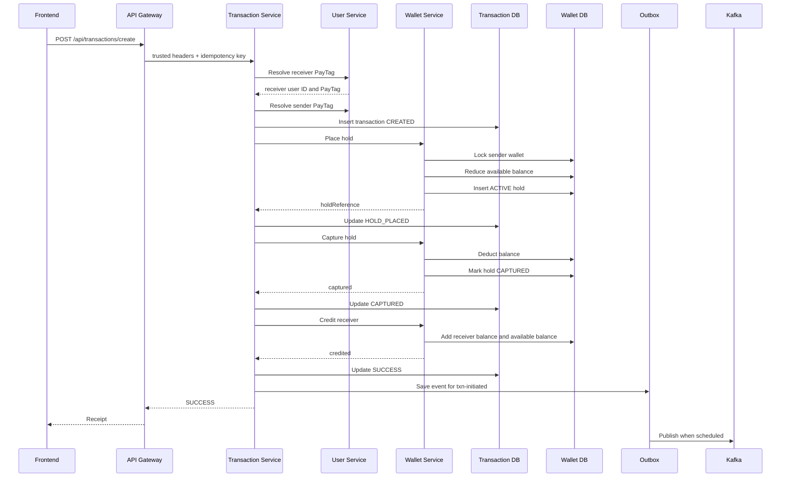
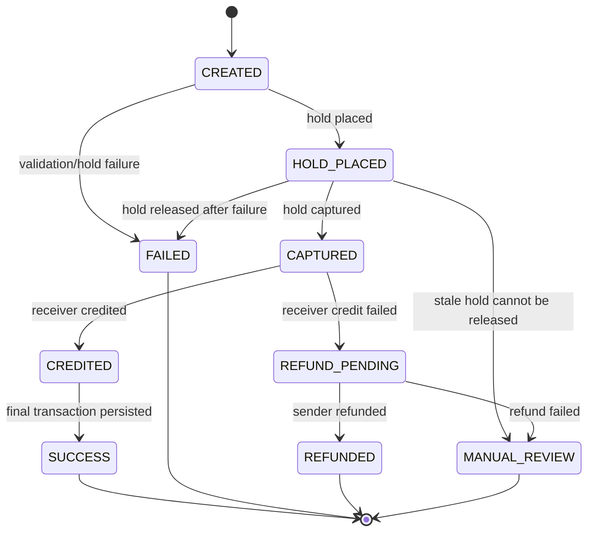

# PayFlow Design Document

This document explains the architecture, design decisions, tradeoffs, and extension points for PayFlow. The root [README](../Readme.md) is the operational entry point; this document is the deeper engineering reference.

## Goals

PayFlow is designed to demonstrate how a payment product can be decomposed into independently owned services while keeping money movement recoverable, auditable, and user-friendly.

Primary goals:

- Support user signup, login, wallet top-up, wallet-to-wallet transfer, rewards, notifications, and admin views.
- Keep all external traffic behind the API Gateway.
- Avoid direct user-driven wallet mutations except top-up.
- Represent money with decimal types.
- Use transaction states and wallet holds to make transfers explicit.
- Publish reward/notification events through a durable outbox.
- Provide enough tests and observability hooks for production hardening.

Non-goals for the current implementation:

- Real payment rail integration.
- Real bank/card top-up provider integration.
- Multi-currency FX conversion.
- Full double-entry ledger as the authoritative accounting model.
- Production-grade service identity such as mTLS.

## Context Diagram



## Container Diagram



## Domain Model

### User

The user service owns:

- `id`
- `name`
- `email`
- `password` hash
- `role`
- `pay_tag`

PayTag is the public transfer identity. It is safer than asking users to enter raw numeric user IDs because it can be validated, normalized, displayed, and changed behind a future aliasing layer.

### Wallet

The wallet service owns:

- `wallets`: ledger and available balances.
- `wallet_holds`: temporary reservations of available balance.
- wallet-side `transactions`: internal audit of wallet mutation operations.

Current wallet balances:

- `balance`: total stored value.
- `available_balance`: spendable value after active holds.

Invariant:

```text
0 <= available_balance <= balance
```

### Transaction

The transaction service owns payment intent and saga state:

- `sender_id`
- `receiver_id`
- `sender_pay_tag`
- `receiver_pay_tag`
- `amount`
- `status`
- `idempotency_key`
- `public_reference`
- `hold_reference`
- `failure_reason`
- timestamps

Transaction statuses include:

```text
CREATED
HOLD_PLACED
CAPTURED
CREDITED
SUCCESS
REFUND_PENDING
REFUNDED
MANUAL_REVIEW
FAILED
```

### Outbox

The transaction outbox stores event publication work:

- aggregate ID
- event key
- event type
- topic
- payload
- status
- attempts
- timestamps
- last error

The outbox makes event publication recoverable after transaction DB success.

### Reward

Rewards are created asynchronously from successful transfer events. A unique transaction ID prevents duplicate rewards.

### Notification

Notifications are created asynchronously from successful transfer events and can be marked read using `read_at`.

## Money Movement Sequence



### Failure Cases

| Step | Failure | Behavior |
| --- | --- | --- |
| PayTag resolution | Receiver not found | Reject before wallet mutation |
| Self-transfer | Sender and receiver same user | Reject before wallet mutation |
| Hold | Insufficient funds | Save failed sender-side transaction, return clear error |
| Capture | Wallet capture fails | Mark failed/manual-review depending on state |
| Receiver credit | Credit fails after capture | Attempt compensating refund |
| Outbox publish | Kafka unavailable | Keep outbox event for retry |
| Reward consumer | Duplicate event | Unique transaction ID prevents duplicate reward |
| Notification consumer | Duplicate event | Current behavior can create duplicate notification unless event idempotency is added |

## Transaction State Machine



## Security Design

### Edge Authentication

The API Gateway validates JWTs for protected routes. It extracts:

- user ID
- email
- role

It then forwards trusted identity headers to services.

### Header Trust Boundary

The gateway removes potentially forged client headers before setting trusted values:

- `X-User-Id`
- `X-User-Email`
- `X-User-Role`
- `X-Internal-Api-Key`
- `X-Gateway-Request-Key`

This prevents a browser from directly claiming another identity through headers.

### Service Boundary Authorization

Services perform their own authorization checks:

- User service restricts admin list APIs to `ROLE_ADMIN`.
- Wallet service allows owners to read/top up their own wallet and requires internal API key for service-only mutations.
- Transaction service requires gateway request key and validates user ownership for history and transaction lookup.
- Reward and notification services validate owner/admin access.

### Tradeoff

The current internal service authentication uses shared secrets. This is much better than unauthenticated internal calls, but it is not the final production answer. In production, replace it with mTLS, SPIFFE/SPIRE, a service mesh, or cloud workload identity.

## API Gateway Design

Gateway responsibilities:

- Route `/auth/**`, `/api/users/**`, `/api/v1/wallets/**`, `/api/transactions/**`, `/api/rewards/**`, `/api/notifications/**`.
- Validate JWTs.
- Add trusted headers.
- Apply Redis rate limiting to high-traffic APIs.
- Configure CORS for frontend origins.

Tradeoff:

- Centralized gateway auth simplifies the frontend and routing.
- Service-level authorization is still required because direct service calls can happen in misconfigured environments.

## Frontend Design

### State Model

Client state:

- Auth token and decoded user identity.
- UI layout state.

Server state:

- Wallet.
- Transactions.
- Rewards.
- Notifications.
- Current user profile.

TanStack Query owns server-state caching and invalidation.

### Forms

Forms use React Hook Form and Zod. Financial input is parsed with `decimal.js`.

Product behavior:

- Errors are shown on submit.
- Stale errors clear on focus or edit.
- Transfer confirmation appears only after PayTag resolution and amount validation.
- Failed transfer responses are not shown as completed receipts.

### Session Restore

The auth provider reads the stored JWT and attaches it to the HTTP client before child route requests execute. This prevents refresh-time dashboard queries from firing without Authorization and causing false logout.

## Data Design

### Why Separate Databases?

Each service owns its data. This avoids accidental cross-service coupling and makes independent deployment easier.

Tradeoff:

- No cross-service joins.
- Read models may need denormalized display data.
- Operational debugging needs correlation IDs and good observability.

### Why Denormalize PayTags in Transactions?

Transaction history must remain readable and must show counterparties. Storing `sender_pay_tag` and `receiver_pay_tag` in transaction rows avoids calling user service for every current row and preserves the display identity used at transaction time.

Tradeoff:

- If a PayTag changes later, historical rows keep the old tag.
- That is acceptable for an audit-style transaction record.

### Why BigDecimal?

Native floating point is not acceptable for money because binary floating point cannot exactly represent decimal currency amounts. PayFlow uses:

- `BigDecimal` in backend DTOs/entities/services.
- `NUMERIC(19,2)` for money columns.
- `decimal.js` in frontend validation and display paths.

## Outbox Design

The transaction service does not rely on “save DB then immediately publish Kafka” as the only mechanism. It saves a transaction outbox row in the same logical flow, then the outbox publisher sends events to Kafka.

Benefit:

- If transaction state commits but Kafka is down, the event remains recoverable.

Tradeoff:

- Event publication is eventually consistent.
- Operators need outbox monitoring and replay tooling.

## Reconciliation Design

The transaction service contains reconciliation support for stale states.

Purpose:

- Find transactions stuck in intermediate states.
- Attempt safe remediation, such as releasing stale holds.
- Mark unrecoverable rows for manual review.

Tradeoff:

- Automated reconciliation must be conservative.
- Manual review state is preferable to silently corrupting balances.

## Observability Design

Current baseline:

- Spring Actuator health/readiness.
- Prometheus metrics endpoints.
- Optional Prometheus and Grafana Compose stack.
- Application logs per local process under `.payflow/logs`.

Needed next:

- OpenTelemetry traces across gateway, services, Kafka consumers, and database calls.
- Correlation ID propagation through Kafka event headers.
- Dashboards for transfer success/failure rates, outbox lag, consumer lag, manual review count, and wallet mutation latency.

## Deployment Design

Local production-like shape:

- Docker Compose network.
- Per-service Postgres.
- Kafka, Redis, optional observability.
- Gateway and frontend as public surfaces.

Production target should preserve:

- Immutable images.
- Runtime secrets from a secret manager.
- Database migrations before rollout.
- Health/readiness gates.
- Service-to-service auth.
- Horizontal scaling for stateless services.
- Kafka partitioning strategy for transaction events.

## Design Decisions and Tradeoffs

| Decision | Why | Tradeoff |
| --- | --- | --- |
| Microservices | Mirrors real payment platform boundaries | More operational complexity |
| API Gateway | Central routing, auth, rate limiting | Gateway becomes critical path |
| Per-service Postgres | Strong ownership and isolation | No simple cross-service joins |
| PayTag recipient identity | Safer and more user-friendly than raw IDs | Requires unique namespace and lookup |
| Hold/capture/credit saga | Makes transfer state explicit | More states and compensations |
| BigDecimal/decimal.js | Correct decimal money handling | More verbose than primitive numbers |
| Outbox | Recoverable event publishing | Eventual consistency and publisher complexity |
| Kafka rewards/notifications | Decouples non-critical side effects | Consumers need idempotency and DLQ |
| `ddl-auto=validate` + Flyway | Predictable schema control | Requires migration discipline |
| Shared internal API key | Simple local internal auth | Should be replaced by mTLS/workload identity |
| `sessionStorage` JWT | Simple SPA auth | XSS risk; secure cookies are better for production |

## Current Limitations

Backend:

- No full double-entry ledger as final source of truth.
- Internal service auth uses shared secrets.
- Kafka DLQ/replay tooling is not complete.
- Notification consumer idempotency is weaker than reward idempotency.
- Admin APIs need pagination and richer filters.
- Reconciliation UI is minimal.
- No real payment provider for top-up.

Frontend:

- No refresh-token flow.
- No receipt export/share feature.
- No advanced search/date filtering.
- Admin UX is functional but still basic.
- Accessibility should be audited with keyboard and screen-reader tooling.

Operations:

- No Kubernetes/Helm manifests yet.
- No production secret manager integration.
- No OpenTelemetry tracing.
- No alerting rules tied to SLOs.
- No automated migration rollback plan.

## Change Guidelines

When extending PayFlow:

1. Keep browser traffic behind the gateway.
2. Do not expose direct wallet credit/debit/capture/release screens to normal users.
3. Use BigDecimal for money on the backend and decimal.js on the frontend.
4. Add Flyway migrations for schema changes.
5. Keep service data ownership intact.
6. Add idempotency for operations that may be retried.
7. Add tests at the correct layer: unit for rules, integration for persistence/API, global flow for cross-service contracts.
8. Update this design document when changing architecture-level behavior.
